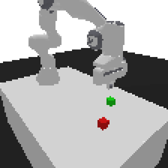

# Project 2: Actor-Critic Robotics — Panda Push from Pixels

**Course:** Reinforcement Learning, Summer 2026 — Kyiv School of Economics <br/>
**Instructor:** Yurii Hannich <br/>
**Points:** 15 (tiered — **5 / 10 / 15**)

---

## The task

Train an agent that controls a Franka Panda robot arm to **push the green cube into the target
zone** (marked by the red "ghost" cube). The agent sees the world **only through pixels** and acts
by outputting **7 joint-angle deltas**.



*A real rollout of a reference agent: reach the cube, then push it onto the red target and keep it
there.*

It might look simple. It is not. From nothing but a **reward signal**, the network has to learn all
of the following, at once:

- **(a) Perception** — tell the objects apart in a raw image (the cube is green, the target is red;
  color is the only thing that separates them).
- **(b) Spatial geometry** — recover 3D layout from a **single** fixed camera view.
- **(c) Inverse kinematics** — figure out how rotating specific joints moves its gripper to a chosen
  point in 3D space (the action is joint deltas, *not* an end-effector position).
- **(d) Contact physics** — exploit contact, friction, and the cube's inertia to move it where it
  should go.
- **(e) Action sequencing** — the goal decomposes into several sub-behaviors (find → reach → push →
  settle), and their order depends on what the agent currently sees.

That is a genuinely hard control problem — and, we hope, a genuinely interesting one. This is
probably the most important and most instructive hands-on element of the course: the goal is not a
leaderboard number, it is **real experience with the practical difficulty of RL** and the intuitions
you build for how to attack problems like this.

---

## The package: `panda-push-pixels`

The environment and the grader are given to you, **frozen**, as a pip package installed from a
pinned git tag:
[**kse-reinforcement-learning-2026-summer/panda-push-pixels**](https://github.com/kse-reinforcement-learning-2026-summer/panda-push-pixels).
Because it is pinned, the environment and the grader are byte-identical on your laptop, on
Colab/Kaggle, and in the instructor's final grading run. Section 0–2 of `project.ipynb` walk through
it interactively; the essentials:

### The environment

A pixel-observation Push task built on [panda-gym](https://github.com/qgallouedec/panda-gym) /
PyBullet, registered as `gym.make("PandaPushPixels-v0")`. It renders the scene to stacked camera
frames and rewards pushing the cube onto the target. The whole observation pipeline (camera, frame
size, stacking, channel order) is part of the contract and **cannot be changed**.

### The input/output contract (read this carefully)

Your submitted `model.pt` must speak the environment's language *exactly*:

| | Spec |
|---|---|
| **Input** | `uint8`, shape `(batch, 12, 112, 112)`, values in `[0, 255]` — **4 stacked RGB frames**, channels-first. Feed it **raw**: SB3's default `normalize_images=True` does the `/255` *inside* the policy, and `export_model` bakes that into the exported graph. |
| **Output** | `float32`, shape `(batch, 7)`, values in `[-1, 1]` — 7 joint position deltas (the gripper stays closed). The grader clips outputs to `[-1, 1]`. |
| **Format** | TorchScript (`torch.jit`), saved on **CPU**. Produced for you by `panda_push_pixels.export_model`. |
| **Size** | ≤ **4,000,000** parameters (the actor only). |

**Why the contract matters.** The grader loads your `model.pt` and runs it in **its own fresh copy**
of the frozen environment. So anything you change about the environment *during training* is invisible
to the grader — which is exactly why you are free to shape rewards and build a curriculum (see below).
The flip side: your model only transfers if it was trained on observations with the **same shape and
distribution** the contract specifies. Train on the provided env; don't rebuild the observation.

### The reward

Sparse and honest: `-1.0` on every step, plus a `+50.0` bonus on the step the task is solved.
"Solved" means the cube stayed within **5 cm** of the target for **5 consecutive steps** (a single-step
graze from a fast-moving cube does **not** count — you can't win by flinging the cube through the
zone). If the cube is within 5 cm right when the 50-step episode times out, that counts too. So an
episode return ranges from `-50` (never solved) to near `0` (solved fast). This reward is a **training
signal** — what the grader actually scores is behavioral (below).

### The grading logic (tiered)

Grading is done by the package (`grading.evaluate`) over deterministic episodes with hidden seeds, on
the grader's own frozen env. Points are **cumulative** — you earn a tier only if the lower ones pass:

- **5 pts** — your notebook trains an allowed SB3 agent (imports one of the course algorithms and
  calls `.learn(...)` in *your own* sections), **and** your `model.pt` loads, obeys the I/O contract,
  and is ≤ 4M parameters.
- **10 pts** — your agent **moves the cube**: `touch_rate ≥ 80%` (the cube's center leaves its spawn
  by more than 1 cm in at least 80% of episodes — direction doesn't matter).
- **15 pts** — your agent **solves the push**: `success_rate ≥ 50%` (cube reaches the target and
  dwells, per the reward above).

`tests/test.py` runs exactly these checks (30 episodes locally / in CI; the final grading run uses 100
episodes and hidden seeds).

---

## Your levers (and their limits)

Vanilla RL straight from pixels with default settings will **not** solve this on a free-tier budget —
Section 2 of the notebook demonstrates a naive baseline flat-lining at `-50`. The interesting work is
engineering. Four levers, each with a hard limit — how you use them is up to you:

1. **Shape the training, not the contract.** You may change *anything about training* — the reward
   (a `gymnasium.Wrapper` that reads the privileged `info` dict: `object_to_target`, `ee_to_object`,
   `is_touching`, `object_position`, `target_position`, …), the episode length, the termination rule,
   and the reset / initial-state distribution (a curriculum via `reset(options=...)`). The grader uses
   its own frozen env, so none of this can break grading — it only shapes *your* learning. **The limit:**
   you may **not** change the observation pipeline, the action space, or the task — a model trained on a
   different observation will not transfer to the grader.
2. **Algorithm & hyperparameters.** You may use any of the five algorithms from Module 2 —
   **A2C, PPO, DDPG, TD3, SAC** — via **Stable-Baselines3** (the workshop stack). On-policy vs
   off-policy is a real trade-off here (sample efficiency vs. parallelism vs. memory); it's yours to
   weigh, along with all the usual hyperparameters.
3. **Network architecture.** You may replace the default CNN feature extractor with your own (via
   `policy_kwargs`) — deeper, wider, whatever perception the task needs. **The limit:** the actor must
   stay **≤ 4M parameters**.
4. **Scale.** More experience helps: parallel environments (`SubprocVecEnv`) for on-policy methods, a
   replay buffer for off-policy ones. **The limit:** your compute (next section) — the simulator itself
   is not free.

*(These are levers, not a recipe. There is no single intended solution — that's the point.)*

---

## Compute — where to run

The environment is a real physics simulator: it takes time to install and CPU to step, *before* you
even start training. Plan around three tiers:

| | Specs (approx.) | Best for |
|---|---|---|
| **Local machine** | your CPU/GPU | running the tests, quick sanity checks, prototyping |
| **Google Colab** (free) | ~2 CPU, ~16 GB RAM, T4 GPU, session/idle limits | prototyping, short training runs, testing hypotheses |
| **Kaggle** (free) | ~4 CPU, ~30 GB RAM, GPU, sessions up to ~9 h, ~30 GPU-h/week | **large-scale training runs** |

`project.ipynb` runs on all three. **Heads-up:** the first install can take **up to ~10 minutes** —
`pybullet` compiles from source. That is normal; don't panic and don't interrupt it.

Suggested rhythm: **prototype** on local + Colab (does my reward/curriculum move the numbers at all?),
then do the **long runs** on Kaggle. Whichever you use, lean on **intermediate evaluations** and
**checkpoint often to durable storage** (Google Drive / a Kaggle dataset) — free sessions disconnect,
and a 6-hour run you can't recover is a bad afternoon.

---

## Repository structure

```
├── README.md            ← you are here
├── project.ipynb        ← YOUR WORKING FILE (Sections 0-2 provided; your work goes in Section 3+)
├── model.pt             ← YOUR trained model (TorchScript, produced by the notebook)
├── requirements.txt     ← one dependency: the panda-push-pixels package (read-only)
├── tests/test.py        ← the exact tests CI runs (read-only)
├── assets/              ← README media
├── .github/             ← CI workflow (read-only)
├── .gitignore
└── LICENSE
```

### What you modify

| File | Description |
|------|-------------|
| `project.ipynb` | Sections 0–2 (environment walkthrough + a naive baseline) are provided — leave them as-is. Do **your** work under the `## 3. Your solution` cell: import an SB3 algorithm, train, and export `model.pt`. |
| `model.pt` | Your trained actor (TorchScript, produced by `export_model`). |

### What you do NOT modify

Everything else — `tests/`, `requirements.txt`, `.github/`, `.gitignore`, `LICENSE`, and Sections 0–2
of the notebook.

> **Warning:** any modification to files outside `project.ipynb` and `model.pt` is logged by GitHub and
> **immediately visible to the instructor**. Tampering with the tests or the CI configuration is treated
> as an academic-integrity violation.

---

## Workflow

### 1. Accept the GitHub Classroom invite

You are here.

### 2. Clone your repository

```bash
git clone https://github.com/kse-reinforcement-learning-2026-summer/rl-project2-actor-critic-robotics-<your-username>.git
cd rl-project2-actor-critic-robotics-<your-username>
```

> If you haven't authenticated Git yet, install the [GitHub CLI](https://cli.github.com/) and run `gh auth login`.

### 3. Open the notebook on Colab or Kaggle

- **Colab:** [colab.research.google.com](https://colab.research.google.com/) → **File → Upload notebook** →
  select `project.ipynb` → **Runtime → Change runtime type → T4 GPU**.
- **Kaggle:** [kaggle.com/code](https://www.kaggle.com/code) → **New Notebook → File → Import Notebook** →
  select `project.ipynb` → enable a GPU accelerator (for the long runs).

Run the install cell first (it takes a up to 10 minutes — see the compute note above).

### 4. Work through the notebook

Sections 0–2 walk you through the environment, what the agent sees, and a naive baseline that fails —
run them to build intuition. Then, from `## 3. Your solution` onward, it's yours: shape a reward,
pick and tune an algorithm, size a network, and train.

### 5. Export and save your model

Use `panda_push_pixels.export_model(model, "model.pt")` and `selfcheck(...)` (Section 2.4 shows how).
Save `model.pt` — and back up your checkpoints to durable storage, since free sessions disconnect.

### 6. Test locally (recommended — this is exactly what CI runs)

```bash
python3.11 -m venv .venv && source .venv/bin/activate
pip install torch==2.12.0+cpu --index-url https://download.pytorch.org/whl/cpu
pip install -r requirements.txt
pytest tests/test.py -v
```

Fix any failures **before** pushing — CI pushes are limited (see below).

### 7. Commit and push

```bash
git add project.ipynb model.pt
git commit -m "Project 2 submission"
git push origin main
```

### 8. Check the Actions tab

On your repository → **Actions** tab: **green ✓** = the tier tests pass, **red ✗** = click the run to
see which tier failed and why.

---

## Evaluation

### Automated checks (CI)

Every push to `main` runs `tests/test.py`, which awards the tiers described in
[The grading logic](#the-grading-logic-tiered): a valid training run + contract-compliant `model.pt`
(5), moving the cube (10), and solving the push (15). CI evaluates 30 episodes; the instructor's final
run uses 100 episodes with **hidden seeds**, so tune for robustness, not for the public seeds.

### After the automated checks

1. **AI code review** — verifies your `project.ipynb` is consistent with the submitted model (you
   actually trained what you turned in).
2. **Plagiarism check** — code-similarity analysis across all submissions.

Both must pass for the points to count.

### Push limit 

**!!! VERY IMPORTANT !!!**

CI here is **expensive** (it installs a physics simulator and runs a batch of episodes), so you have
**10 pushes** that trigger CI. Everything you need to check your work is available locally — **always
run `pytest tests/test.py` locally before pushing.**

---

## Troubleshooting

| Problem | What to do |
|---|---|
| Install takes forever / seems stuck | Normal — `pybullet` compiles from source (up to ~10 min the first time). Don't interrupt it. |
| Reward stuck at `-50` | The sparse reward gives almost no gradient. This is the core challenge — shape a dense reward from the `info` dict and/or start easier via a curriculum. `grading.evaluate(..., verbose=True)` shows per-episode behavior. |
| `model.pt` has too many parameters | The **actor** must be ≤ 4M. Slim your feature extractor / `net_arch`. Check with `grading.count_parameters("model.pt")`. |
| `selfcheck` fails (export ≠ policy) | Train on the **provided** env with SB3 defaults and export via `panda_push_pixels.export_model` (it bakes the `/255` correctly). Don't hand-roll the export. |
| `model.pt` fails to load in CI | Export on **CPU** (`export_model` does this) — a CUDA-bound TorchScript won't load on the CPU grader. |
| `count_parameters` says 0 params | You called `torch.jit.freeze`. Use `export_model` (it doesn't freeze). |
| Out of memory (off-policy) | Pixels are heavy — shrink `buffer_size` and try `optimize_memory_usage=True`. |
| Colab/Kaggle disconnects mid-training | Checkpoint periodically to Google Drive / a Kaggle dataset. |
| Tests pass locally but fail in CI | Make sure both `project.ipynb` **and** `model.pt` are committed and pushed (`git log --oneline`, and check the file list on GitHub). |

---

## AI tools

All AI tools are **fully allowed** — chat assistants, coding agents, deep research, anything. Use them
actively: brainstorm reward designs, debug training, sanity-check ideas. You may commit any
AI-generated notes/docs (`.md`, etc.) alongside your code; it won't affect grading.

If you're new to AI coding tools, some free options:
- [**Cursor**](https://cursor.sh/) — VS Code fork with a built-in AI agent
- [**Windsurf**](https://windsurf.com/) — AI coding agent, free tier
- [**GitHub Copilot**](https://github.com/features/copilot) — free for students via GitHub Education

---

## Quick reference

```bash
# Clone
git clone https://github.com/kse-reinforcement-learning-2026-summer/rl-project2-actor-critic-robotics-<username>.git

# Test locally (exactly what CI runs)
pytest tests/test.py -v

# Submit
git add project.ipynb model.pt
git commit -m "your message"
git push origin main
```

This is a hard problem — but a solvable one. If you get stuck, ask questions, talk through ideas with
an AI agent, and experiment. **Good luck!**
